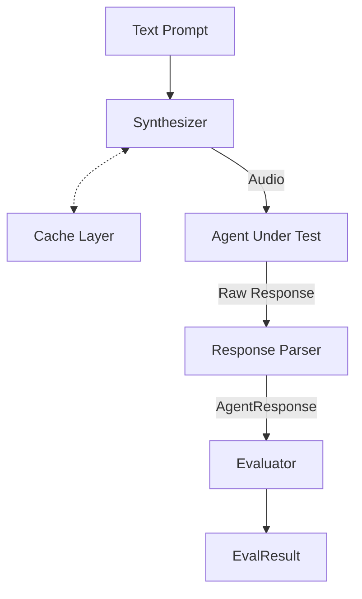
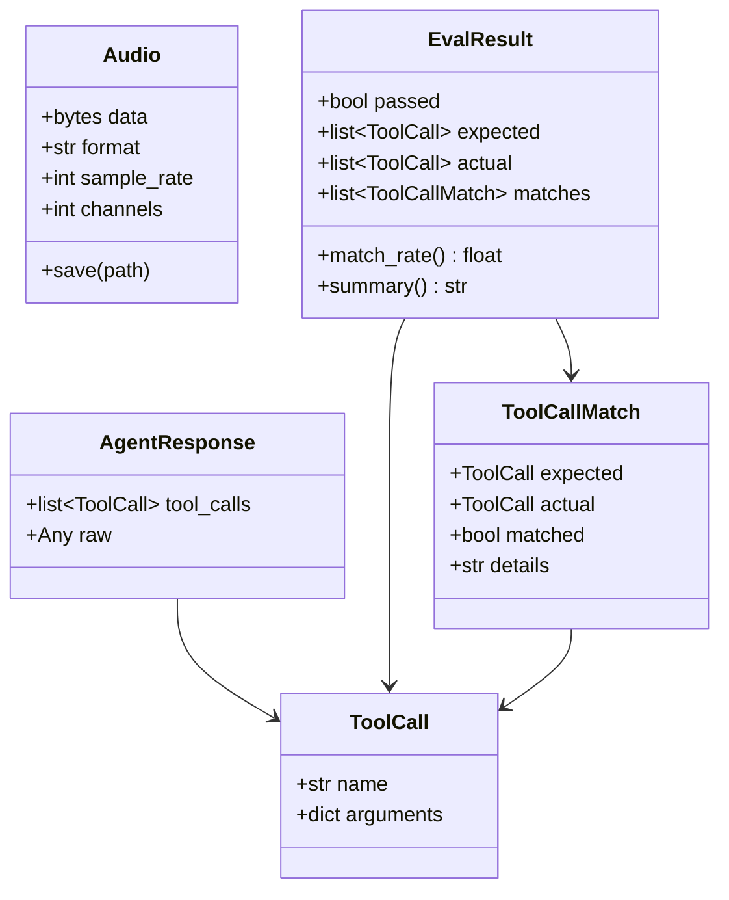

# Architecture

russo is designed around a simple pipeline with pluggable components connected by protocols.

## The Pipeline



### Flow

1. **Text Prompt** → The natural language instruction (e.g., "Book a flight from Berlin to Rome")
2. **Synthesizer** → Converts text to audio using a TTS provider. The cache layer intercepts here to avoid redundant API calls.
3. **Agent** → The LLM agent under test receives the audio and returns tool calls. Agents may use a **ResponseParser** internally to normalize provider-specific formats.
4. **Evaluator** → Compares expected tool calls against actual ones, producing a detailed `EvalResult`.

## Data Types

All data flows through Pydantic models:



## Design Principles

### Protocol-based (Structural Typing)

russo uses `typing.Protocol` for all extension points. You never inherit from a base class — if your object has the right methods, it works:

```python
# This is a valid Synthesizer — no inheritance needed
class MySynth:
    async def synthesize(self, text: str) -> Audio:
        ...
```

### Async-first

The pipeline is fully async. Synthesizers and agents are `async` methods, making it natural to call external APIs without blocking.

### Provider-agnostic

The core pipeline knows nothing about Gemini, OpenAI, or any specific provider. Provider-specific logic lives in adapters and parsers.

### Pydantic Models

All data types are Pydantic models, giving you:

- Automatic validation
- Serialization / deserialization
- Rich `repr` for debugging
- Type safety

## Module Layout

```
russo/
├── __init__.py          # Public API surface
├── _types.py            # Pydantic data models
├── _protocols.py        # Protocol definitions
├── _pipeline.py         # The run() function
├── _cache.py            # AudioCache + CachedSynthesizer
├── _helpers.py          # tool_call() + @agent decorator
├── _assertions.py       # assert_tool_calls()
├── adapters/            # Agent adapters (Gemini, OpenAI, HTTP, WS)
├── synthesizers/        # TTS providers (Google)
├── evaluators/          # Matching logic (ExactEvaluator)
├── parsers/             # Response normalizers (Gemini, OpenAI)
├── report/              # Terminal + HTML reporting
├── pytest_plugin.py     # pytest integration
├── cli.py               # CLI runner
├── config.py            # Config file loading
├── models.py            # Extended models for CLI/config mode
├── interfaces.py        # ABC interfaces for CLI/config mode
├── pipeline.py          # CLI pipeline runner
└── registry.py          # Component registry for config mode
```

Private modules (prefixed with `_`) contain the core API. Public modules contain provider-specific implementations and integrations.
