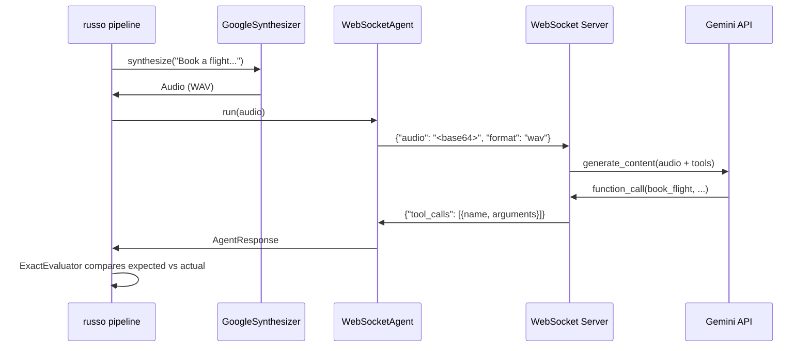

# WebSocket Testing (End-to-End)

A complete end-to-end example: a WebSocket server wrapping a real Gemini model with tool declarations, tested using russo's `WebSocketAgent`, `GoogleSynthesizer`, and pytest plugin. No mocks -- real TTS, real LLM, real WebSocket transport.

!!! tip "Source files"
    [`examples/websocket_testing/`](https://github.com/mohit2152sharma/russo/tree/main/examples/websocket_testing)

## Prerequisites

```bash
pip install "russo[ws]"
```

You need one of:

- **Google AI API key**: `export GOOGLE_API_KEY="..."`
- **Vertex AI credentials**: `export GOOGLE_CLOUD_PROJECT="..."` (or `GOOGLE_PROJECT_ID`) + Application Default Credentials

## Architecture



The server acts as a thin proxy: it receives audio over WebSocket, forwards it to Gemini with tool declarations, parses the function-call response, and returns structured JSON that russo's default `WebSocketAgent` protocol understands.

## Step 1: The WebSocket server

The server uses Python's `websockets` library (a russo dependency -- no FastAPI or uvicorn needed).

### Tool declarations

Tools are declared in Gemini's `function_declarations` format:

```python
TOOLS = [
    {
        "function_declarations": [
            {
                "name": "book_flight",
                "description": "Book a flight between two cities.",
                "parameters": {
                    "type": "object",
                    "properties": {
                        "from_city": {"type": "string", "description": "Departure city"},
                        "to_city": {"type": "string", "description": "Destination city"},
                    },
                    "required": ["from_city", "to_city"],
                },
            },
            {
                "name": "search_hotels",
                "description": "Search for hotels in a city.",
                "parameters": {
                    "type": "object",
                    "properties": {
                        "city": {"type": "string", "description": "City to search hotels in"},
                        "checkin_date": {"type": "string", "description": "Check-in date"},
                    },
                    "required": ["city"],
                },
            },
            {
                "name": "get_weather",
                "description": "Get current weather information for a city.",
                "parameters": {
                    "type": "object",
                    "properties": {
                        "city": {"type": "string", "description": "City to get weather for"},
                    },
                    "required": ["city"],
                },
            },
        ]
    }
]
```

!!! warning "Gemini tool format"
    Gemini expects tools wrapped as `{"function_declarations": [...]}`, **not** as bare `{name, description, parameters}` dicts. Passing bare dicts will silently produce text responses instead of function calls.

### Connection handler

Each WebSocket connection handles one audio-to-tool-call exchange:

```python
async def _handle_connection(ws):
    from google.genai import types

    # 1. Receive base64-encoded audio
    raw = json.loads(await ws.recv())
    audio_bytes = base64.b64decode(raw["audio"])

    # 2. Wrap in WAV if needed, send to Gemini
    data, mime_type = _ensure_wav(audio_bytes)
    client = _make_client()
    response = await client.aio.models.generate_content(
        model="gemini-2.0-flash",
        contents=[types.Part.from_bytes(data=data, mime_type=mime_type)],
        config=types.GenerateContentConfig(
            tools=TOOLS,
            system_instruction=SYSTEM_INSTRUCTION,
        ),
    )

    # 3. Parse function calls and return
    tool_calls = []
    for candidate in (response.candidates or []):
        for part in (candidate.content.parts or []):
            if part.function_call:
                fc = part.function_call
                tool_calls.append({
                    "name": fc.name,
                    "arguments": dict(fc.args) if fc.args else {},
                })

    await ws.send(json.dumps({"tool_calls": tool_calls}))
```

### Auth resolution

The server auto-detects credentials from the environment:

```python
def _make_client():
    from google import genai

    project = (
        os.environ.get("GOOGLE_CLOUD_PROJECT")
        or os.environ.get("GOOGLE_PROJECT_ID")
    )
    if project:
        return genai.Client(
            vertexai=True,
            project=project,
            location=os.environ.get("GOOGLE_CLOUD_LOCATION", "us-central1"),
        )
    return genai.Client()  # uses GOOGLE_API_KEY
```

!!! note "Tilde expansion"
    The `google-auth` library does **not** expand `~` in `GOOGLE_APPLICATION_CREDENTIALS`. The example handles this automatically with `os.path.expanduser()`.

## Step 2: Configure fixtures in `conftest.py`

### Server lifecycle

A session-scoped fixture starts the server as a subprocess on a random port:

```python
@pytest.fixture(scope="session")
def travel_agent_server():
    port = _find_free_port()
    proc = subprocess.Popen(
        [sys.executable, _SERVER_SCRIPT, "--port", str(port)],
        stdout=subprocess.PIPE,
        stderr=subprocess.PIPE,
    )
    try:
        _wait_for_server(port)  # polls until accepting connections
        yield port
    finally:
        proc.terminate()
        proc.wait(timeout=5)
```

### russo fixtures

```python
@pytest.fixture
def russo_synthesizer():
    """Google TTS -- Vertex AI or API key from environment."""
    project = _gcp_project()
    if project:
        return GoogleSynthesizer(
            vertexai=True,
            project=project,
            location=os.environ.get("GOOGLE_CLOUD_LOCATION", "us-central1"),
        )
    return GoogleSynthesizer()


@pytest.fixture
def russo_agent(travel_agent_server):
    """WebSocketAgent pointing at the local server."""
    port = travel_agent_server
    return WebSocketAgent(url=f"ws://localhost:{port}")


@pytest.fixture
def russo_evaluator():
    return ExactEvaluator()
```

!!! warning "Function-scoped synthesizer"
    `russo_synthesizer` is intentionally **function-scoped** (not session-scoped). The `genai.Client` created inside `GoogleSynthesizer` has internal `asyncio.Lock` objects that bind to whichever event loop first uses them. Since pytest-asyncio creates a new event loop per test by default, a session-scoped client would crash on the second test with `RuntimeError: is bound to a different event loop`. The russo plugin wraps the synthesizer in `CachedSynthesizer` anyway, so TTS results are still cached to disk.

## Step 3: Write tests

Tests use `@pytest.mark.russo` -- the plugin handles synthesizing audio, running the agent, and evaluating the result.

### Single-run tests

```python
@pytest.mark.russo(
    prompt="Book a flight from Berlin to Rome",
    expect=[russo.tool_call("book_flight", from_city="Berlin", to_city="Rome")],
)
async def test_book_flight(russo_result):
    russo.assert_tool_calls(russo_result)


@pytest.mark.russo(
    prompt="Search for hotels in Paris",
    expect=[russo.tool_call("search_hotels", city="Paris")],
)
async def test_search_hotels(russo_result):
    russo.assert_tool_calls(russo_result)


@pytest.mark.russo(
    prompt="What is the weather in Tokyo",
    expect=[russo.tool_call("get_weather", city="Tokyo")],
)
async def test_get_weather(russo_result):
    russo.assert_tool_calls(russo_result)
```

### Reliability testing

Run the same prompt multiple times and assert a minimum pass rate:

```python
@pytest.mark.russo(
    prompt="Book a flight from Berlin to Rome",
    expect=[russo.tool_call("book_flight", from_city="Berlin", to_city="Rome")],
    runs=3,
)
async def test_flight_reliability(russo_result):
    assert isinstance(russo_result, russo.BatchResult)
    assert russo_result.pass_rate >= 0.66
```

### Prompt variants

Test multiple phrasings of the same intent:

```python
@pytest.mark.russo(
    prompts=[
        "I need to fly from Berlin to Rome",
        "Please book me a flight, departing Berlin, arriving Rome",
        "Get me on a plane from Berlin to Rome",
    ],
    expect=[russo.tool_call("book_flight", from_city="Berlin", to_city="Rome")],
)
async def test_prompt_variants(russo_result):
    assert isinstance(russo_result, russo.BatchResult)
    assert russo_result.pass_rate >= 0.66
```

## Step 4: Run

```bash
# Set credentials (one of these)
export GOOGLE_API_KEY="your-key"
# or
export GOOGLE_CLOUD_PROJECT="your-project"

# Run all tests
pytest examples/websocket_testing/ -v
```

Expected output:

```
test_agent.py::test_book_flight PASSED
test_agent.py::test_search_hotels PASSED
test_agent.py::test_get_weather PASSED
test_agent.py::test_flight_reliability PASSED
test_agent.py::test_prompt_variants PASSED
```

You can also start the server manually for debugging:

```bash
python examples/websocket_testing/server.py --port 8765
```

## How it works

1. **Server subprocess** -- `conftest.py` starts `server.py` on a random port before any tests run (session-scoped fixture). The server listens for WebSocket connections.

2. **TTS** -- `GoogleSynthesizer` converts each prompt string to audio via Google's TTS API. Results are cached to disk by `CachedSynthesizer`.

3. **WebSocket transport** -- `WebSocketAgent` connects to the server, sends `{"audio": "<base64>", "format": "wav"}`, and waits for the response. This is the default JSON protocol -- no custom hooks needed.

4. **Gemini inference** -- The server decodes the audio, sends it to `gemini-2.0-flash` with tool declarations, and parses function calls from the response.

5. **Evaluation** -- `ExactEvaluator` compares actual tool calls against expected ones. `russo.assert_tool_calls()` raises a descriptive error on mismatch.

## See also

- [WebSocket Agent](websocket-agent.md) -- `WebSocketAgent` protocol options (bytes mode, custom hooks)
- [pytest Integration](pytest-integration.md) -- markers, fixtures, and CLI options
- [Gemini Adapters](gemini-adapter.md) -- direct Gemini SDK usage without a server
- [Concurrent Runs](concurrent-runs.md) -- `runs` and `prompts` for reliability testing
