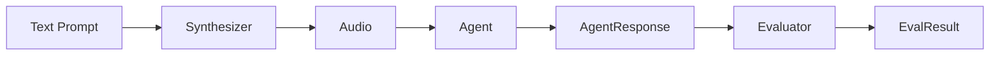

# russo

<p align="center">
    <em>Testing framework for LLM tool-call accuracy — audio & text</em>
</p>
<p align="center">
<a href="https://pypi.org/project/russo" target="_blank">
    
</a>
<a href="https://pypi.org/project/russo" target="_blank">
    
</a>
<a href="https://github.com/mohit2152sharma/russo/blob/main/LICENSE" target="_blank">
    
</a>
</p>

---

**Documentation**: <a href="https://mohit2152sharma.github.io/russo" target="_blank">https://mohit2152sharma.github.io/russo</a>

**Source Code**: <a href="https://github.com/mohit2152sharma/russo" target="_blank">https://github.com/mohit2152sharma/russo</a>

---

**russo** is a testing framework for verifying that LLM agents make the correct tool calls when given audio (or text) input. Think of it as **pytest for voice AI tool-calling accuracy**.

## Why russo?

Voice AI agents powered by LLMs increasingly use **tool calling** (function calling) to take actions — booking flights, controlling smart homes, querying databases. But how do you verify the agent calls the *right* tool with the *right* arguments when it hears a spoken command?

russo solves this with a simple pipeline:

```
Text Prompt → Synthesizer (TTS) → Agent Under Test → Evaluator → Pass/Fail
```

## Key Features

- **Provider-agnostic** — works with Gemini, OpenAI, or any custom agent via structural typing (protocols)
- **Audio-first** — synthesize text prompts to audio, send to your agent, evaluate tool calls
- **pytest integration** — use markers, fixtures, and familiar test patterns
- **Built-in caching** — skip TTS on repeated runs, saving time and money
- **Extensible** — swap synthesizers, agents, evaluators, and parsers without inheritance

## Quick Example

```python
import russo
from russo.synthesizers import GoogleSynthesizer
from russo.adapters import GeminiLiveAgent
from russo.evaluators import ExactEvaluator

result = await russo.run(
    prompt="Book a flight from Berlin to Rome for tomorrow",
    synthesizer=GoogleSynthesizer(api_key="..."),
    agent=GeminiLiveAgent(api_key="...", tools=[...]),
    evaluator=ExactEvaluator(),
    expect=[
        russo.tool_call("book_flight", from_city="Berlin", to_city="Rome"),
    ],
)

assert result.passed
```

Or with **pytest**:

```python
import pytest
import russo

@pytest.mark.russo(
    prompt="Book a flight from NYC to LA",
    expect=[russo.tool_call("book_flight", from_city="NYC", to_city="LA")],
)
async def test_book_flight(russo_result):
    russo.assert_tool_calls(russo_result)
```

## Architecture

russo uses a **protocol-based** design. You never need to inherit from base classes — if your object has the right methods, it works:



| Protocol | Method | Purpose |
|---|---|---|
| `Synthesizer` | `async synthesize(text) → Audio` | Convert text to audio |
| `Agent` | `async run(audio) → AgentResponse` | Run the agent under test |
| `Evaluator` | `evaluate(expected, actual) → EvalResult` | Compare tool calls |
| `ResponseParser` | `parse(raw) → AgentResponse` | Normalize provider responses |

## Next Steps

- [Installation](getting-started/installation.md) — install russo and optional dependencies
- [First Test](getting-started/first-test.md) — write your first tool-call test
- [Tutorial](tutorial/index.md) — deep dive into every component
- [API Reference](reference/index.md) — full API documentation
