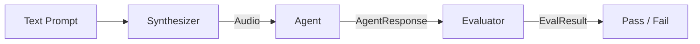

# Tutorial

This tutorial covers every major component of russo in detail. Work through it sequentially, or jump to the section you need.

## Overview

russo's architecture is a simple pipeline with pluggable components:

Each component is defined by a **protocol** (structural typing). You don't need to inherit from anything — just implement the right method signature.

## Sections

| Section | What You'll Learn |
|---|---|
| [Pipeline](pipeline.md) | How `russo.run()` orchestrates the full flow |
| [Adapters](adapters.md) | Connecting to Gemini, OpenAI, HTTP, WebSocket, or custom agents |
| [Synthesizers](synthesizers.md) | Converting text prompts to audio |
| [Evaluators](evaluators.md) | Comparing expected vs actual tool calls |
| [Caching](caching.md) | Skipping TTS calls on repeated test runs |
| [pytest Plugin](pytest-plugin.md) | Markers, fixtures, CLI options, and reporting |
